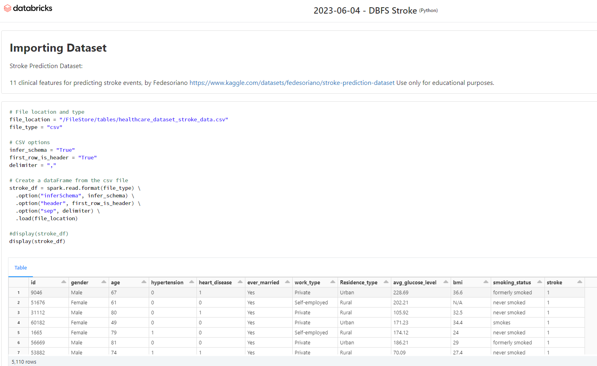
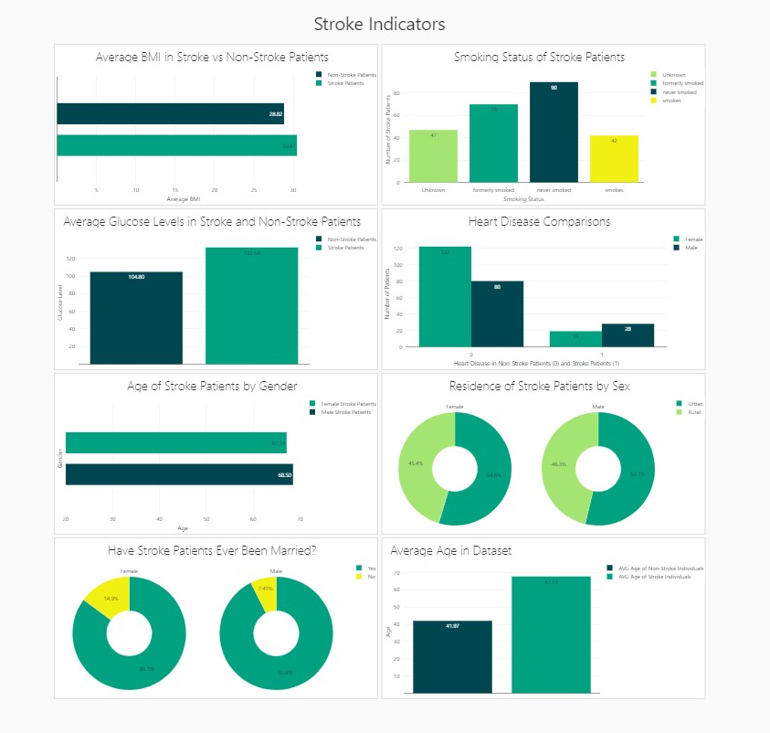

# Project4

For this project our team was tasked to solve, analyze, or visualize a problem using machine learning (ML) with other technologies that we’ve learned throughout our course while following specific requirements.

### Our Team: 

Leah Apking

Erin Clark

Nancy Gomez

Sheila Troxel

# Our Project - Predictive Risks of Stroke

### Exploring Datasets

To begin our project, we explored healthcare datasets, looking for data that included other health factors in addition to whether a patient had a stroke or not, as this would be key in helping us build a model that could predict with high accuracy. We found a dataset that has been built for stroke prediction online at Kaggle.com that included 11 clinical features for predicting stroke events. These features included: Gender, Age, Hypertension, Heart Disease, Average Glucose, BMI, Smoking Status, Work Type, Residence Type, Ever Married , and Stroke Status.

### Previewing Data

Using a DataBricks notebook, Python, and Spark SQL we were able to review and analyze the stroke prediction data to learn more about the patients included in the data and how the clinical features may factor into our predictions. 

Using a DataBricks notebook, we were able to easily develop visualization from our table and analysis to create dashboard for sharing and updating our findings. 

### Summary of Stroke Data Findings
In reviewing the `health-dataset-stroke-data.csv`, our data included patient data for 5110 individuals. Only 249 patients had experienced a stroke. With our data heavily weighted on non-stroke patients, we were curious if other factors in our dataset might affect our model. Here are our findings. 

 <ins> Average Age <ins> 
* Average age of patients in the dataset = 43.23
* Average age of non-stroke patients = 41.97
* Average age of stroke patients = 67.73

<ins> Health History <ins>
* More men in our dataset experience a stroke vs women only by a small margin.
* Heart disease and hypertension appeared more in non-stroke patients than with stroke patients.
* Patients that experienced a stroke had an average glucose level of 132.54 vs non stroke patients who averaged 104.80.
* Average BMI in both candidates differed by a small margin. Stroke patients had an average BMI of 30.47 and non-stroke patients had an average BMI of 28.82.

<ins> Lifestyle <ins>
* Where patients lived did not appear to have a significant impact on stroke or non-stroke individuals, with urban residences being slightly higher. 
  This could be simply due to higher population in urban areas.
* Only 90 stroke patients were non-smokers with 159 labeled as unknown, former smokers, or past smokers.
  
## Building the Machine Learning Model
Now that we have a better idea of what our data looks like, we can begin to build a model. 
  
Using Google Collab, we created notebook where we imported our dependencies, installed Spark and Java, set our environment variables and started a SparkSession. Next, we read in the healthcare-dataset-stroke-data.csv via AWS into a Spark DataFrame.

  
 ### Preprocessing the data
 Printing the Spark Dataframe schema, we can determine data types prior to converting to a Pandas DataFrame and droping non-beneficial columns or NaN values and changing data types.
 
 
